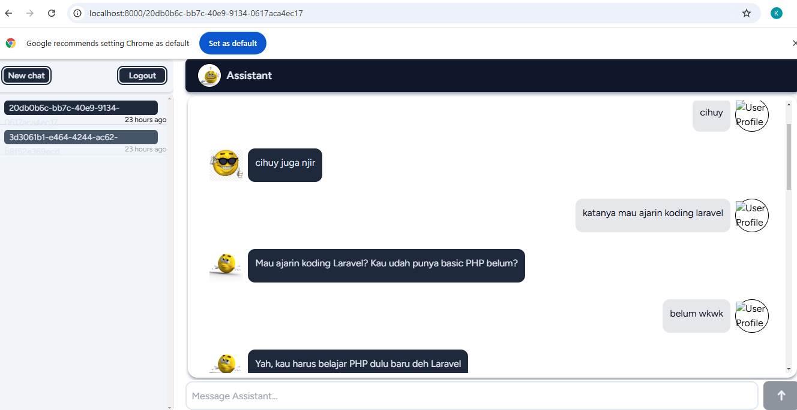
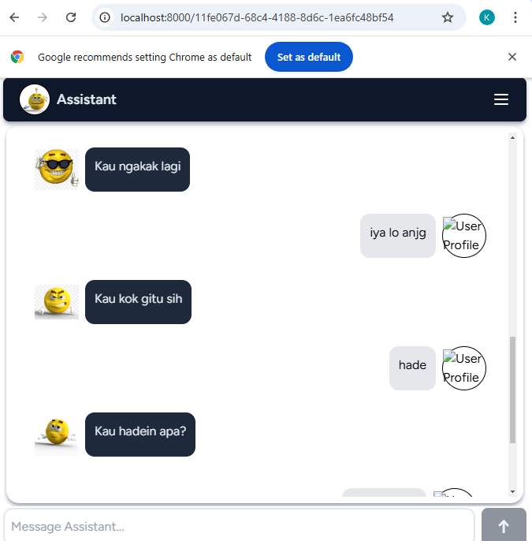

# Expressive bot

An expressive bot leveraging structured output from large language models (LLM) to deliver clear and organized responses.


## Screenshots
Dekstop


Mobile




## Run Locally

Clone the project

```bash
  git clone https://github.com/komikodok/expressive-bot-llms
```

Go to the project directory

```bash
  cd <project-directory>
```

Install dependencies

```bash
  npm install
```

Install python dependencies
```bash
  cd fastapi
```
```bash
  pip install -r requirements.txt
```

Start the server

```bash
  npm run dev
```
```
  php artisan serve
```

Start server for chat api

```bash
  cd fastapi
```
```bash
  uvicorn main:app --port 8001 --reload
```

## Environment

What needs to be added to .env
```bash  
GOOGLE_CLIENT_ID="<your client id from google>"
GOOGLE_CLIENT_SECRET="<your client secret key from google>"
GOOGLE_CLIENT_REDIRECT="<your redirect url>"

MODEL_CONFIG = "<llm>"
GROQ_API_KEY = "<your groq api key>"
SECRET_KEY = "<your secret key for create jwt>"

FASTAPI_URL = "http://localhost:8001"
LARAVEL_URL = "http://localhost:8000"
```